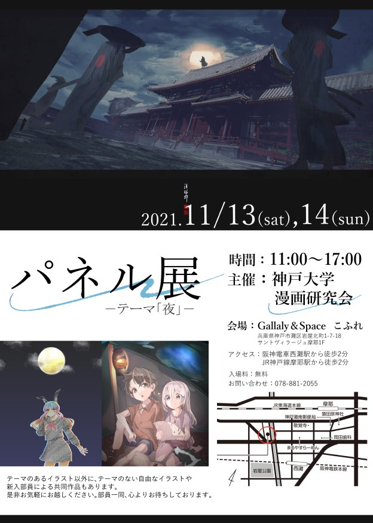

 <!-- 

            ここでは、六甲祭の中止によりweb上での公開となった2020年度発行の
   

2020年度発行の<strong>「みーはー175/VOOM+67」</strong>

2021年度発行の<strong>「みーはー177/VOOM+69」</strong>

    を公開しています。

　

　
 -->

    2021年度は六甲祭は中止となりましたが、ギャラリーを借りて展示を行うことが決定しました。

    <a href="http://gscoffret.com/concept.html">
        <strong>Gallery & Space こふれ</strong>様
    </a>

にて、

<strong>11/13.14の11時〜17時</strong>

の間展示会を行います。

テーマは<strong>「夜」</strong>です。

入場料は<strong>無料</strong>、

アクセスは<strong>阪神電車西灘駅から徒歩2分</strong>、<strong>JR神戸線摩耶駅から徒歩2分</strong>です。

ぜひお越しください。

 